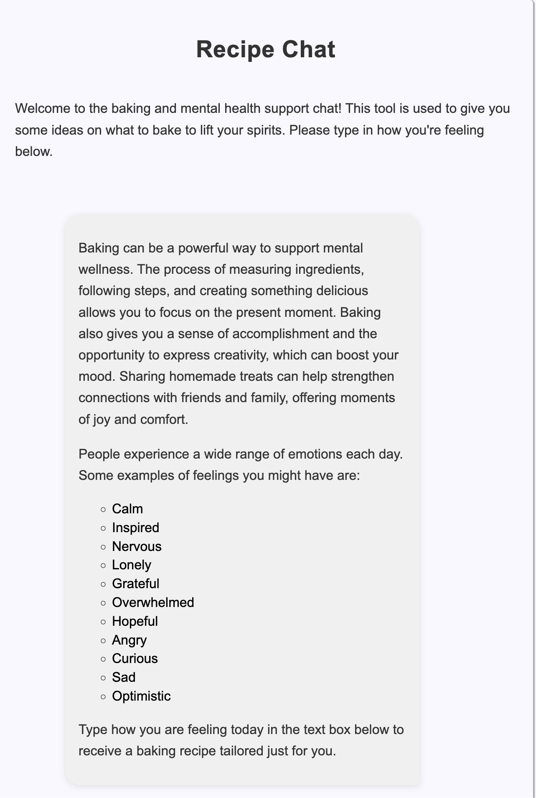
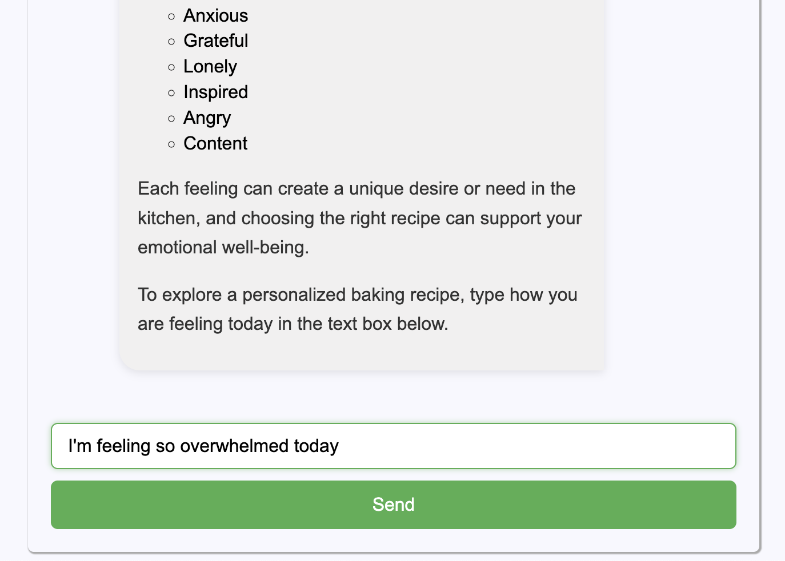
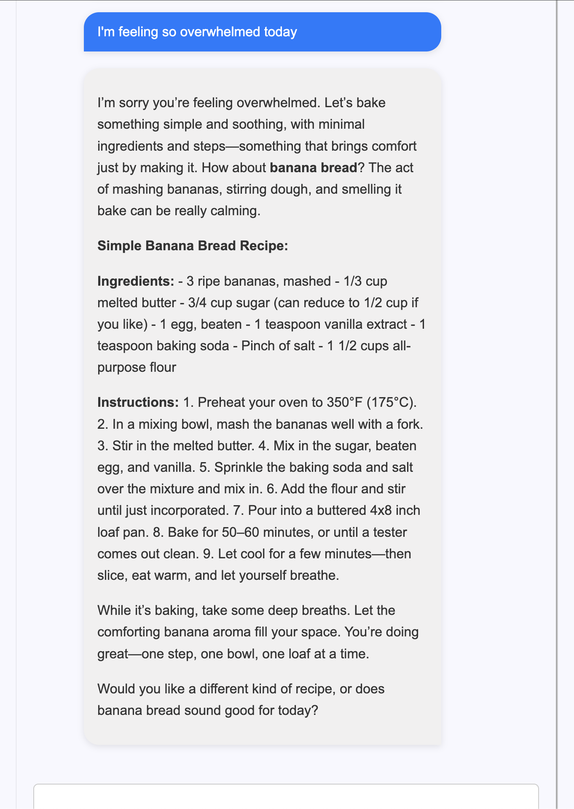

# Introduction
Welcome to my first node project!

The concept of this project is to have a framework to create different driven by the open ai api (Chat GPT).


# Project Setup
1. `docker-compose up --buid -d`
2. `docker exec -it chat bash`
3. From the container:
   `cd src && npm install`

# Setup Local Development
1. Add api key to src/.env
```bash
OPENAI_API_KEY="YOUR API KEY"
```
2. Start the socket.io server
`cd src && npm run watch`
3. Navigate to `http://0.0.0.0:3000` in your browser

   
# Usage Examples  

The initial first concept was to implement a chatbot for a person with mental health struggles and suggest recipes for baking to help them feel better and keep busy.

Its been shown through numerous studies and antecdotal evidence that baking improves overall mood and stress

### 1. First the initial prompt shows information on the above when the user loads the page:


### 2. Next the user will enter how they are feeling in this moment



### 3. Next the user will receive a recipe suggestion to boost their mood



# Future Enhancements
1. generalize the logic so different chats can be created for different applications utilizing the prompts dir and json structure
2. Admin interface for storing and updating prompts
3. Ability to train custom models using the openai api for example having it ingest custom recipes
4. Admin interface for uploading and storing custom models
5. There's some concurrency issues with duplicate messages to be diagnosed. Implementing some sort of session logic most likely to resolve
6. Add different routes ie `/recipes`, `/customer-service` etc which will load different models and chat functionality